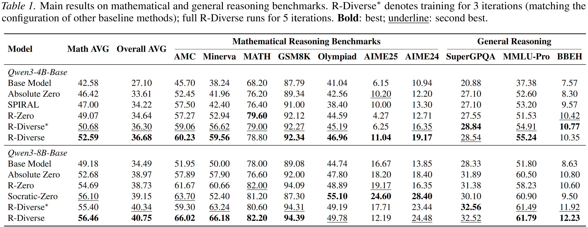
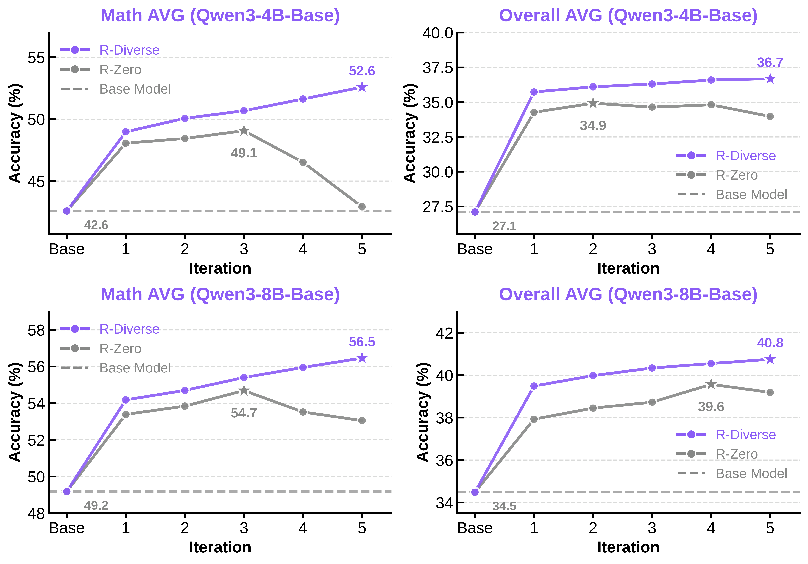

<div align="center">

🐴🧧🎊 **Happy Chinese New Year! Wishing you a prosperous and joyful Year of the Horse!** 🎆🏮🐴

# R-Diverse: Mitigating Diversity Illusion in Self-Play LLM Training

[](https://arxiv.org/abs/2602.13103)
[](LICENSE)
[](https://huggingface.co/RyukiRi/R-Diverse)

</div>

<div align="center">

</div>

## Abstract

Self-play bootstraps LLM reasoning through an iterative Challenger-Solver loop: the Challenger is trained to generate questions that target the Solver's capabilities, and the Solver is optimized on the generated data to expand its reasoning skills. However, existing frameworks like R-Zero often exhibit **non-sustained improvement**, where early gains degrade as self-play continues. We identify a key failure mode, **Diversity Illusion**, where the Solver's training signals appear diverse yet collapse into recurring underlying patterns. It manifests as:

1. **Local Diversity Illusion** — diversity is enforced only within-batch, inducing cross-iteration mode cycling;
2. **Surface Diversity Illusion** — questions vary superficially but require near-identical reasoning skills.

To mitigate them, we propose **R-Diverse** with two aligned innovations:

- **Memory-Augmented Penalty (MAP)**: uses a persistent memory bank to discourage recycling across iterations.
- **Skill-Aware Measurement (SAM)**: evaluates diversity by the reasoning skills exercised rather than surface variation of questions.

Across **10** math and general reasoning benchmarks, R-Diverse sustains gains over more iterations and consistently outperforms prior self-play methods.

## Method

R-Diverse introduces two complementary mechanisms to dismantle the Diversity Illusion:

- **Memory-Augmented Penalty (MAP)** maintains a persistent memory bank across iterations. It penalizes similarity to historical questions via a dual-perspective penalty (max-similarity + mean-similarity), preventing cross-iteration mode cycling. A memory replay mechanism further stabilizes Solver training under distribution shift.

- **Skill-Aware Measurement (SAM)** redefines diversity at the reasoning-skill level. It first maps each question to a canonical Python solver program (via Qwen2.5-Coder-7B) to strip away narrative variation, then embeds the code using Jina-Code-Embeddings to compute semantic similarity. This ensures diversity is measured by the reasoning skills exercised, not surface question phrasing.

<div align="center">

</div>

## Results

### Main Results

Across both Qwen3-4B-Base and Qwen3-8B-Base, R-Diverse achieves state-of-the-art performance on **10** math and general reasoning benchmarks:

- **Qwen3-4B-Base**: Math AVG 42.58 → **52.59** (**+10.01**)
- **Qwen3-8B-Base**: Math AVG 49.18 → **56.46** (**+7.28**)
- General reasoning gains also transfer: Overall AVG improves by **+9.58** (4B) and **+6.26** (8B)

<div align="center">

</div>

### Sustained Improvement

A key advantage of R-Diverse is **sustained improvement** over 5 evolution iterations, while R-Zero collapses after iteration 3-4. This validates that MAP and SAM effectively mitigate both Local and Surface Diversity Illusions.

<div align="center">

</div>

## Key Contributions

- Identification and formalization of the **Diversity Illusion** failure mode in self-play LLM training.
- A novel **Memory-Augmented Penalty (MAP)** mechanism for cross-iteration diversity enforcement.
- A **Skill-Aware Measurement (SAM)** metric that captures true reasoning-level diversity.
- Consistent improvements over prior self-play methods across **10** reasoning benchmarks.

## Release Plan

> We plan to release model weights and inference code within 1-2 week, and will open-source the full R-Diverse training pipeline upon acceptance. Stay tuned!

| Artifact | Status |
| :--- | :---: |
| Paper | [Available](https://arxiv.org/abs/2602.13103) |
| Model Weights | In 1-2 Weeks |
| Inference Code | In 1-2 Weeks |
| Training Code | Upon Acceptance |

## Citation

If you find this work useful, please cite our paper:

```bibtex
@article{li2026rdiverse,
  title={R-Diverse: Mitigating Diversity Illusion in Self-Play LLM Training},
  author={Li, Gengsheng and He, Jinghan and Wang, Shijie and Zhang, Dan and Liu, Ruiqi and Zhang, Renrui and Yao, Zijun and Fang, Junfeng and Guo, Haiyun and Wang, Jinqiao},
  journal={arXiv preprint arXiv:2602.13103},
  year={2026}
}
```

## Contact

For questions or discussions, please open an issue or contact **ligengsheng2024@ia.ac.cn**.

## Acknowledgements

This project is built upon [R-Zero](https://github.com/Chengsong-Huang/R-Zero) and [EasyR1](https://github.com/hiyouga/EasyR1). We thank [Chengsong Huang](https://github.com/Chengsong-Huang) for the kind help and for open-sourcing R-Zero, which serves as the foundation of this work.
